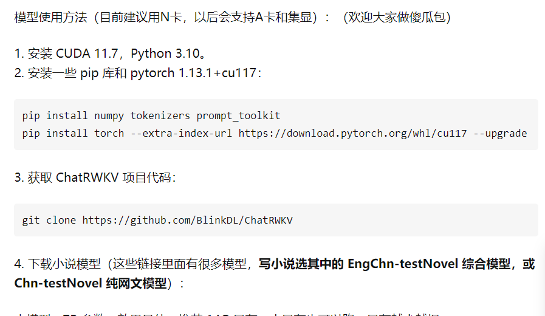

# GPT AI项目文档

## 项目介绍

公司除了调用openAI的第三方api实现AI对话，还有自己本地部署和实现的chatgpt的模型。这篇文档就介绍一下公司目前本地部署和实现的chatgpt模型。

## 模型介绍

    技术人员尝试了很多市场开源的模型，已经有了比较成熟的本地部署方法。下面我一一介绍这些模型。

### BELLE模型

    BELLE模型是一种开源的中文模型，团队作者给出了自己的训练好的模型数据和中文训练数据集，并给出了简单详细的训练方法。因此，我们可以直接使用作者给出的中文模型数据，也可以根据作者给出的教程训练一个适合公司业务的模型数据。

    Github地址:[https://github.com/LianjiaTech/BELLE](https://github.com/LianjiaTech/BELLE)

    Github项目中给出了各种模型数据的下载地址和运行教程，可以详细阅读readme文件进行部署或者训练。

    需要注意的是，加载最小的7B模型(非量化版)，最少需要3090的24G显存，3060只能运行量化版本的7B模型，在models/gptq目录中，对模型数据进行了压缩，模型的对话效果也大打折扣。

### LMFlow模型

    LMFlow模型是由港科大给出的一个中文训练模型，但是目前没有公开其训练好的模型数据，只给出了一个比较简单的模型，效果比较差，需要自己训练。

    Github地址:[https://github.com/OptimalScale/LMFlow](https://github.com/OptimalScale/LMFlow)

### ChatRwkv模型

ChatRwkv模型是由BlinkDL团队推出的一个模型，这个团队给出的模型很多，是在AI-writer的基础上升级的模型，有适合写小说的模型(用中文网文训练得来)，也有适合用来回答问题的模型，不过小说模型目前只支持续写。

    Github地址:[https://github.com/BlinkDL/ChatRWKV](https://github.com/BlinkDL/ChatRWKV)

    作者给出了模型的运行中文文档:[https://zhuanlan.zhihu.com/p/609154637](https://zhuanlan.zhihu.com/p/609154637)

当然，作者也给出了一些傻瓜包，可以去探索。
